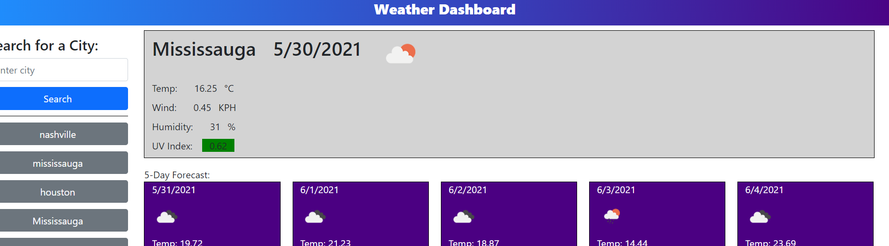

# Weather-dashboard

## Summary
#### The program ask you to input a city and using openWeather API it gets current weather and 5 days weather. It also save the search results that you can click and get current and 5 day weather again. 

## Techonolgies
#### HTML, CSS, Javascript, openWeather API, MomentJS and Jquery

## Instalation/Website
#### https://szali3.github.io/Weather-dashboard/

## Contributor
#### Zohaib Ali